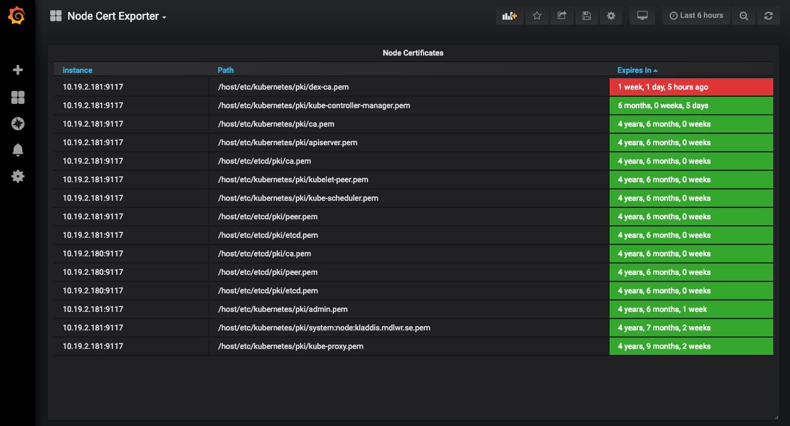

# node-cert-exporter
[](https://github.com/amimof/node-cert-exporter/actions/workflows/go.yaml) [](https://goreportcard.com/report/github.com/amimof/node-cert-exporter) [](https://godoc.org/github.com/amimof/node-cert-exporter)

---

`Prometheus` exporter for x509 certificates written in Go. `node-cert-exporter` will parse SSL certificates in a number of directories recursively and expose their expiry as a Prometheus metric at `/metrics`. It can run on `Kubernetes` as a `Deployment` or `DaemonSet`, or using `Docker`. 

*This project is currently in beta and is looking for contributors. Feel free to leave your feedback using issues or pull requests.*

# Kubernetes DaemonSet
```
kubectl apply -f https://raw.githubusercontent.com/amimof/node-cert-exporter/master/deploy/daemonset.yml
```

# Docker
```
docker run -p 9117:9117 amimof/node-cert-exporter --logtostderr=true --include-glob /etc/ssl/*/*.pem
```

# Helm
```
helm repo add node-cert-exporter https://amimof.github.io/node-cert-exporter
helm repo update
helm install node-cert-exporter node-cert-exporter/node-cert-exporter
```

# Binary
```
curl -LOs https://github.com/amimof/node-cert-exporter/releases/latest/download/node-cert-exporter-linux-amd64 && chmod +x node-cert-exporter-linux-amd64
./node-cert-exporter-linux-amd64 --include-glob /etc/ssl/*/*.pem
```

# Building from source
```
git clone https://github.com/amimof/node-cert-exporter.git
cd node-cert-exporter
make
```

# Grafana Dashboard
Once the the node-cert-exporter is scraped by Prometheus, the metrics can easily be visualized using [Grafana](https://grafana.com). Get started by using the [Node Cert Exporter](https://grafana.com/dashboards/9999) dashboard hosted at grafana.com.



# Contribute
All help in any form is highly appreciated and your are welcome participate in developing together. To contribute submit a Pull Request. If you want to provide feedback, open up a Github Issue or contact me personally.